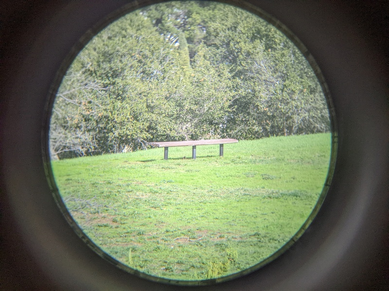
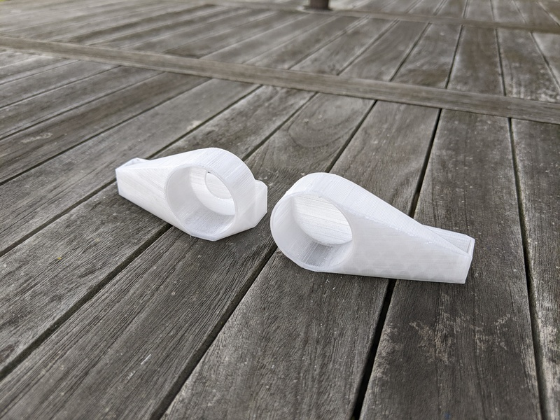
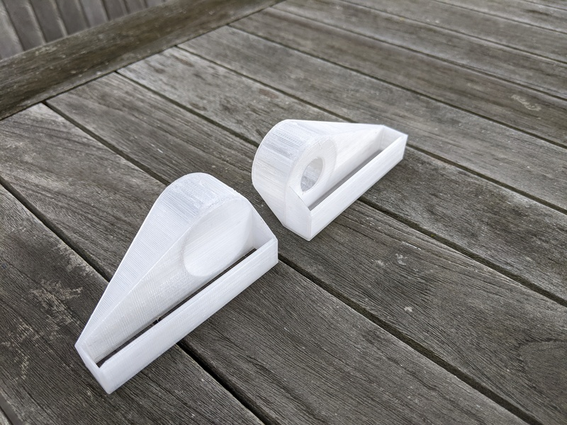
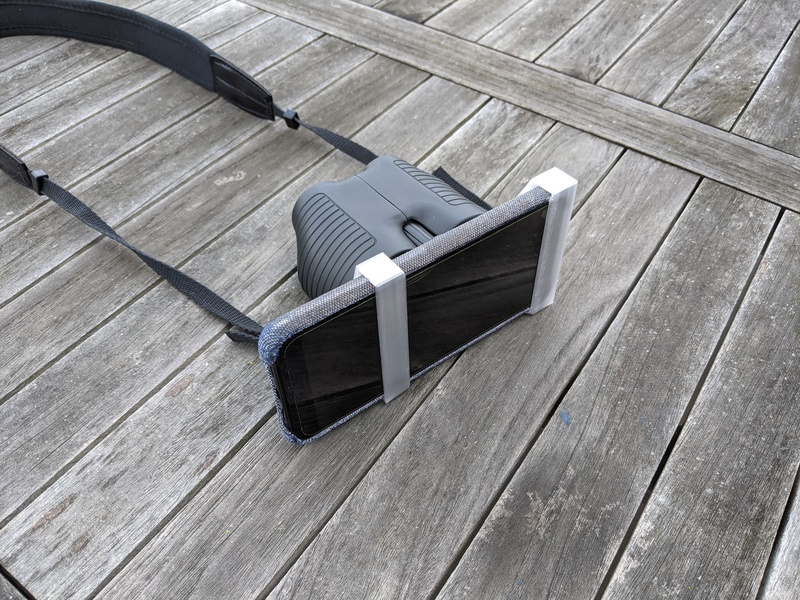
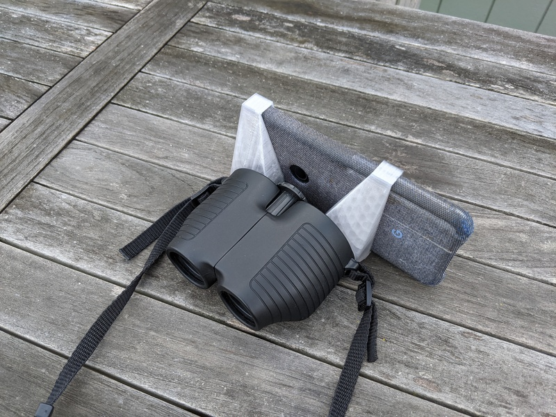

# Digiscope Mono/Binocular Phone Bracket

An eyepiece alignment bracket that holds your phone against
your binoculars (or telescope) eyepiece aligned properly,
as well as an optional second piece to use the other eyecup
to support the rest of the phone.

Makes it so you can hold and focus the binoculars without
an extra hand for the phone.

Printing:

* Infill: 30%
* Adhesion: none
* Support: off
* Orientation: default
* Quality: 0.2mm
* Material: PETG

